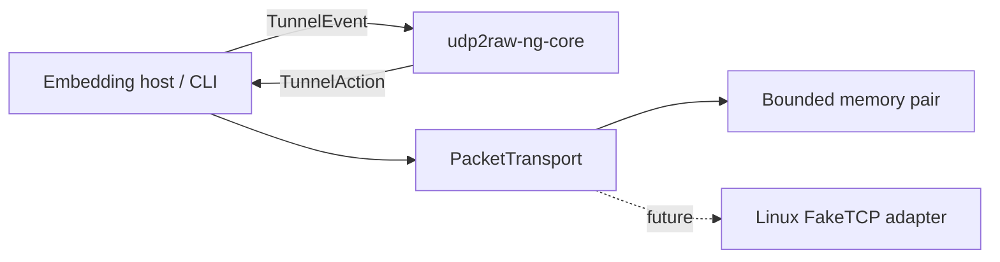

# Architecture



`udp2raw-ng-core` is synchronous and platform-independent. It never performs I/O. Hosts execute actions and feed results back as events. Linux outer-packet handling belongs only to `udp2raw-ng-net`; managed Tokio orchestration belongs to `udp2raw-ng`.

The dependency direction is strictly:

```text
udp2raw-ng -> udp2raw-ng-net -> udp2raw-ng-core
udp2raw-ng --------------------> udp2raw-ng-core
```

The outer TCP/IP envelope is never a security boundary. Once implemented, only the authenticated inner protocol may create or mutate logical session and conversation state.

The authenticated receive path is deliberately ordered as:

```text
bounded envelope parse
    -> session/direction/context validation
    -> AEAD or HMAC authentication
    -> replay-window update
    -> plaintext return
    -> session/conversation mutation or delivery
```

Authentication failure never advances the replay window. Unauthenticated input cannot create an authenticated session or conversation and cannot reach plaintext delivery.

The v3 handshake is loss-tolerant without making the client optimistic:

```text
ClientHello
    -> stateless authenticated HelloRetry(cookie)
ClientHello(cookie)
    -> ServerHello (bounded pending state starts here)
ClientFinish
    -> protected HandshakeAck
    -> both endpoints Ready
```

The server cookie is bound to the host-assigned `PeerId`, handshake transcript fields, cipher suite and a bounded lifetime. It is authenticated with a process-random secret separate from the PSK. Duplicate validated hellos, finishes and acknowledgements are idempotent. The client remains `Handshaking` until it opens the protected acknowledgement.
