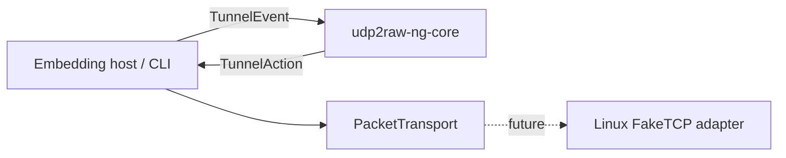

# Architecture



`udp2raw-ng-core` is synchronous and platform-independent. It never performs I/O. Hosts execute actions and feed results back as events. Linux outer-packet handling belongs only to `udp2raw-ng-net`; managed Tokio orchestration belongs to `udp2raw-ng`.

The dependency direction is strictly:

```text
udp2raw-ng -> udp2raw-ng-net -> udp2raw-ng-core
udp2raw-ng --------------------> udp2raw-ng-core
```

The outer TCP/IP envelope is never a security boundary. Once implemented, only the authenticated inner protocol may create or mutate logical session and conversation state.
